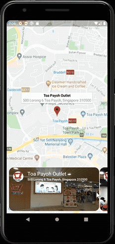
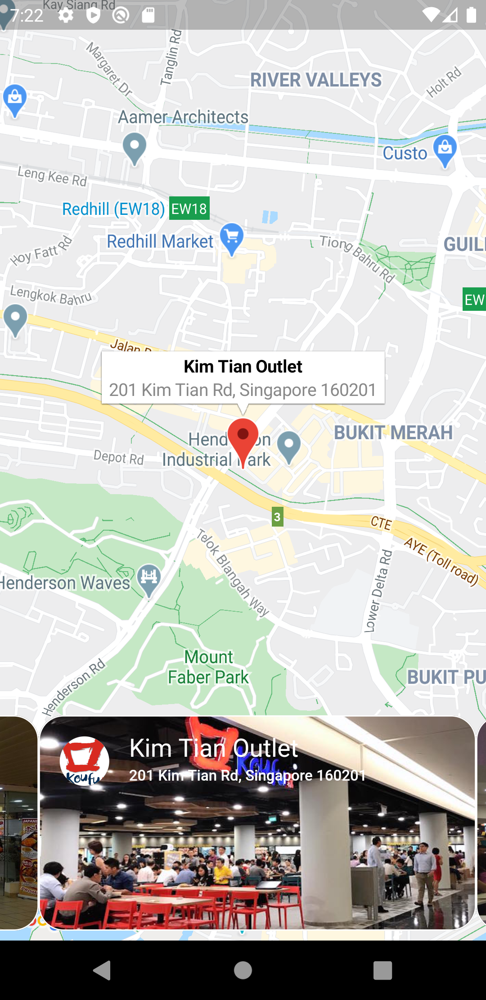
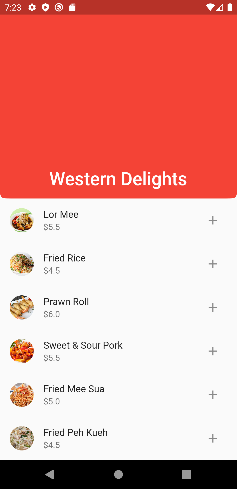

# flutter - food_order_app

My first attempt at a flutter application. 

It is an alternative UI design to Koufu Eat food ordering application. All images used belong to their respective owners. 

## Screenshot

## Getting Started
You will need to add your google API keys into the respective files. Refer to the link below to do so:
- [Adding Google Maps to the app](https://codelabs.developers.google.com/codelabs/google-maps-in-flutter/#3)

## Flutter

A few resources to get you started if this is your first Flutter project:

- [Lab: Write your first Flutter app](https://flutter.dev/docs/get-started/codelab)
- [Cookbook: Useful Flutter samples](https://flutter.dev/docs/cookbook)

For help getting started with Flutter, view our
[online documentation](https://flutter.dev/docs), which offers tutorials,
samples, guidance on mobile development, and a full API reference.
